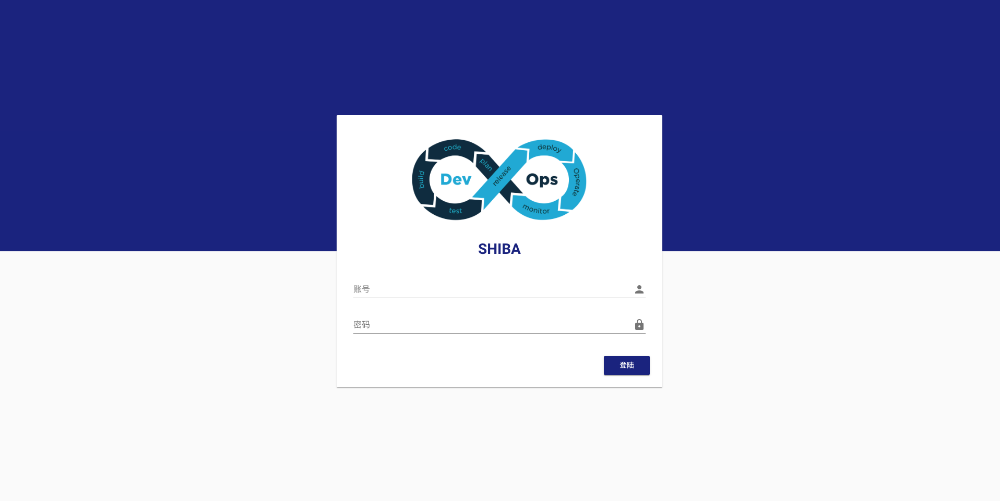
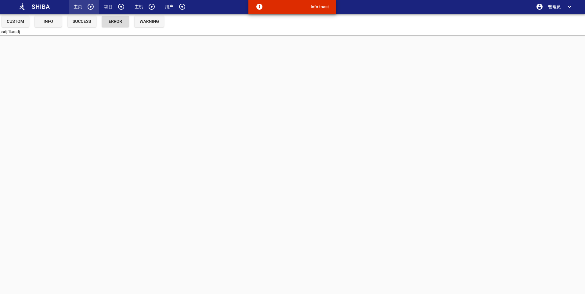
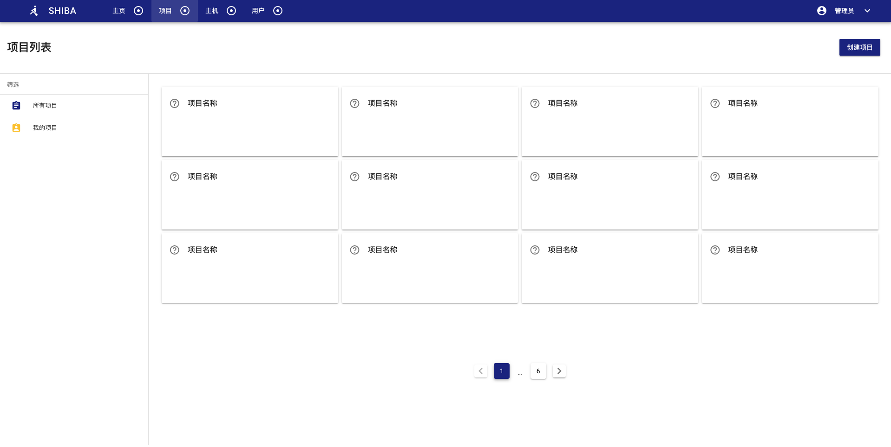
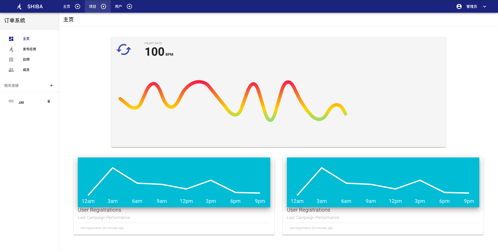
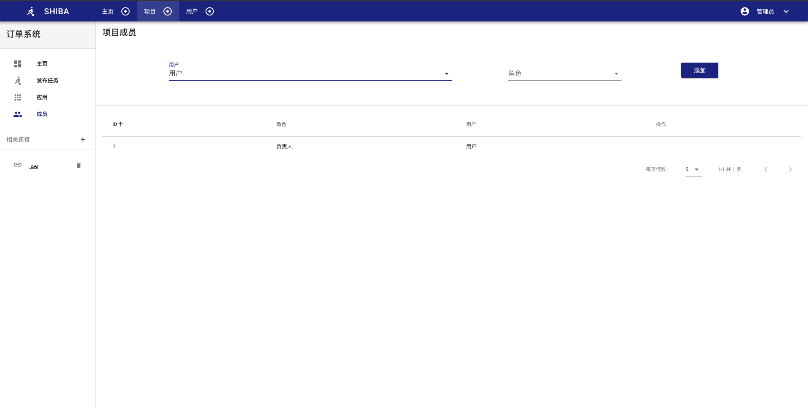

# shiba

计划做一套运维发布系统，目前代码绝大部分代码未完成

如何运行
```javascript

依赖： python 3.6+、mongodb

pip install -r requirements.txt

config/dev.py 修改 mongo uri

python main.py


依赖： nodejs

cd web

npm install

npm run dev

http://127.0.0.1:3000
```

### 未完成功能截图：






```感兴趣或有需求的朋友可以一起参与，WeChat：18516696557```